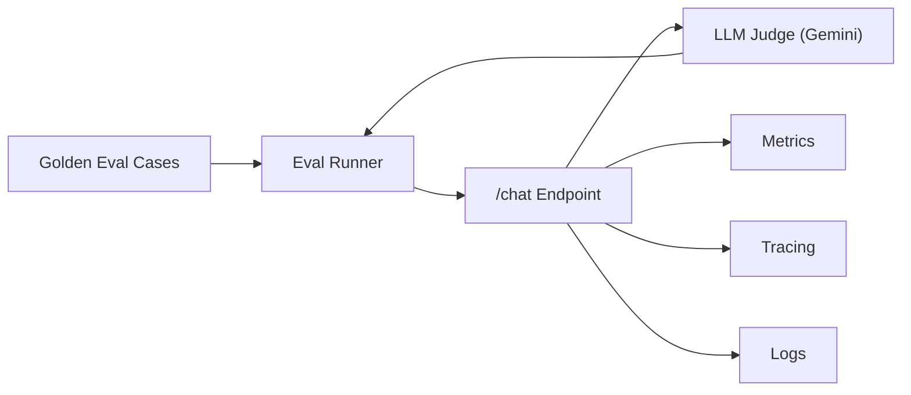
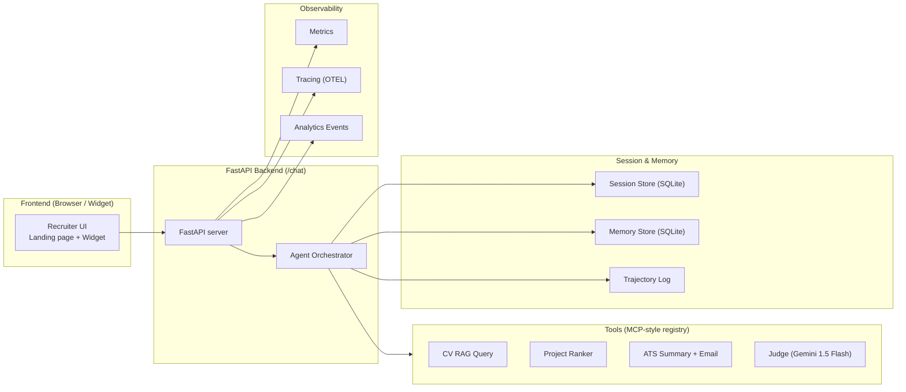

📊 Evaluation Pipeline — LLM-as-a-Judge

```mermaid
flowchart LR
    CASES["Golden Eval Cases"] --> RUN["Eval Runner"]
    RUN --> CHAT["/chat Endpoint"]
    CHAT --> JUDGE["LLM Judge (Gemini)"]
    JUDGE --> RUN
    CHAT --> MET["Metrics"]
    CHAT --> TRACE["Tracing"]
    CHAT --> LOG["Logs"]
```

```mermaid
flowchart LR
    subgraph Client["Frontend (Browser / Widget)"]
        UI["Recruiter UI<br/>Landing page + Widget"]
    end

    subgraph API["FastAPI Backend (/chat)"]
        SRV["FastAPI server"]
        AGENT["Agent Orchestrator"]
    end

    subgraph TOOLS["Tools (MCP-style registry)"]
        CVRAG["CV RAG Query"]
        PROJ["Project Ranker"]
        ATS["ATS Summary + Email"]
        JUDGE["Judge (Gemini 1.5 Flash)"]
    end

    subgraph DATA["Session & Memory"]
        SESS["Session Store (SQLite)"]
        MEM["Memory Store (SQLite)"]
        TRAJ["Trajectory Log"]
    end

    subgraph OBS["Observability"]
        METRICS["Metrics"]
        TRACES["Tracing (OTEL)"]
        LOGS["Analytics Events"]
    end

    UI --> SRV --> AGENT
    AGENT --> TOOLS
    AGENT --> SESS
    AGENT --> MEM
    AGENT --> TRAJ
    SRV --> METRICS
    SRV --> TRACES
    SRV --> LOGS
```
